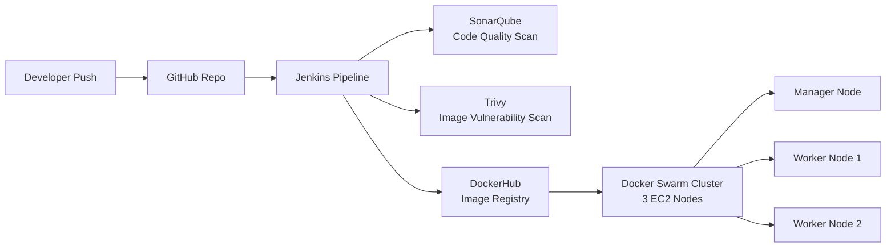

# Social Platform — Full-Stack App with Automated DevSecOps Pipeline

A full-stack social media web application, built and deployed end-to-end with a production-style CI/CD pipeline — from code commit to a live 3-node Docker Swarm cluster on AWS.

> Replace this line with a one-sentence pitch, e.g. *"A Twitter-style social platform with an automated build, scan, and deploy pipeline running on self-managed container orchestration."*

---

## 🏗️ Architecture



**Flow:** Code is pushed to GitHub → Jenkins triggers a build → SonarQube checks code quality → Trivy scans the built image for vulnerabilities → image is pushed to DockerHub → services are deployed/updated across the 3-node Docker Swarm cluster on AWS EC2.

---

## 🛠️ Tech Stack

| Layer | Technology |
|---|---|
| Frontend | JSP (Java Server Pages) |
| Backend | Spring MVC 4.2, Spring Security, Hibernate |
| Database | MySQL 5.7 |
| App Server | Tomcat 8 (JRE 11) |
| Build Tool | Maven |
| Containerization | Docker, Docker Swarm |
| CI/CD | Jenkins (Declarative Pipeline) |
| Code Quality | SonarQube |
| Security Scanning | Trivy |
| Image Registry | DockerHub |
| Infrastructure | AWS EC2 (3-node cluster) |

---

## ⚙️ CI/CD Pipeline

The Jenkins pipeline automates the full path from commit to deployment:

1. **Checkout** — pulls latest code from GitHub
2. **Build** — builds the application and Docker images
3. **Code Quality Gate** — SonarQube static analysis; pipeline fails on quality gate breach
4. **Security Scan** — Trivy scans images for known CVEs before they ship
5. **Push** — tagged image pushed to DockerHub
6. **Deploy** — `docker stack deploy` rolls out the update across the Swarm cluster with zero-downtime service updates

```groovy
pipeline {
    agent {
        node {
            label 'dev'
        }
    }
tools{
    maven 'mymaven'
}
environment{
    scanner_home=tool 'mysonar'
}

    stages {
        stage('CleanWs') {
            steps {
                cleanWs()
            }
        }
        stage('Code'){
            steps{
                git 'https://github.com/jyothisai0336/Docker_Web_App.git'
            }
        }
        stage('CQA'){
            steps{
                withSonarQubeEnv('mysonar') {
                    sh "mvn clean verify sonar:sonar -Dsonar.projectKey=Docker"
                }
            }
        }
        stage('Quality Gates'){
            steps{
                waitForQualityGate abortPipeline: false, credentialsId: 'mysonar'
            }
        }
        stage('Build'){
            steps{
                sh 'mvn clean package'
                sh 'cp -r target Docker-app'
            }
        }
        stage('Docker_Build'){
            steps{
                    sh 'docker build -t jyothisai33/docker:app-image Docker-app'
                    sh 'docker build -t jyothisai33/docker:db-image Docker-db'
            }
        }
        stage('Img-scan'){
            steps{
                sh 'trivy image jyothisai33/docker:app-image'
                sh 'trivy image jyothisai33/docker:db-image'
            }
        }
        stage('push'){
            steps{
                script{
                    withDockerRegistry(credentialsId: 'docker') {
                    sh 'docker push jyothisai33/docker:app-image'
                    sh 'docker push jyothisai33/docker:db-image'
                }
            }
        }
        }
        stage('Stack'){
            steps{
                sh'docker stack deploy myapp --compose-file=compose.yml'
            }
        }
    }
}
```

> Trim/replace this snippet with your actual `Jenkinsfile` content (with credentials referenced via Jenkins credential IDs, never hardcoded).

---

## ✨ Features

- *[User authentication / registration]*
- *[Create, like, comment on posts]*
- *[User profiles]*
- *[Add your actual features here]*

---

## 🖥️ Infrastructure

- **3-node Docker Swarm cluster** self-managed on AWS EC2 (1 manager, 2 worker nodes)
- Services distributed across nodes for redundancy
- Manual scaling via `docker service scale`

---

## 🚀 Getting Started (Local Setup)

```bash
# Clone the repo
git clone https://github.com/jyothisai0336/Docker_Web_App.git
cd Docker_Web_App

# Build and run with Docker Compose
docker-compose up --build
```

App will be available at `http://localhost:<port>`.

---

## 📸 Screenshots

> Add 2-3 screenshots of the running app here — these matter more to recruiters than the text.

---

## 🔒 Known Limitations

Being upfront about current gaps:

- **No HTTPS yet** — currently served over HTTP; TLS termination (e.g. via Nginx reverse proxy + Let's Encrypt) is a planned next step.
- *[Add any other known gaps, e.g. the CSRF/Spring Security item if resolved or still open]*

---

## 📈 What This Project Demonstrates

- End-to-end CI/CD pipeline design with Jenkins Declarative syntax
- Shift-left security: code quality (SonarQube) and image scanning (Trivy) gates before deployment
- Container orchestration with Docker Swarm across multiple nodes
- AWS EC2 infrastructure setup and management

---

## 📬 Contact

**Jyothisai Mekala**
DevOps / DevSecOps Engineer
📧 mekalajyothisai8@gmail.com
